# NotebookLM Clone 🎙️

[](https://www.python.org/downloads/)
[](https://reactjs.org/)
[](https://fastapi.tiangolo.com/)
[](LICENSE)

A full-stack AI-powered application that replicates Google's NotebookLM functionality. Upload PDF documents, chat with them using advanced RAG (Retrieval-Augmented Generation), and automatically generate engaging podcast-style audio conversations with AI hosts discussing the document content.

## 🌟 Project Summary

This project demonstrates the power of modern AI technologies by combining:
- **Document Intelligence**: RAG-based question answering over PDF documents
- **Natural Language Processing**: Context-aware conversations using LLMs
- **Audio AI**: Realistic podcast generation with multiple AI voices
- **Modern Web Development**: Beautiful, responsive UI with glassmorphic design

Perfect for researchers, students, content creators, or anyone who wants to transform written content into engaging audio format or have intelligent conversations with their documents.

## 📽️ Watch the video

[](https://youtu.be/ymgPvhN0xko)

## ✨ Key Features

### 💬 RAG Document Chat (Left Panel)
- **📄 PDF Upload**: Drag and drop or select PDF documents
- **🤖 Intelligent Q&A**: Ask questions and get contextual answers from your documents
- **🔍 Semantic Search**: FAISS-powered vector similarity search for accurate retrieval
- **⚡ Fast Processing**: Efficient chunking and embedding generation
- **💾 Local Storage**: All data stored locally - no external vector database services
- **🎯 Source Attribution**: See which document sections were used to generate answers

### 🎙️ AI Podcast Generation (Right Panel)
- **🎭 Dual AI Hosts**: Natural conversations between Alex (enthusiastic) and Jordan (knowledgeable)
- **🗣️ Human-like Voices**: ElevenLabs TTS integration for professional audio quality
- **⏱️ Controlled Duration**: Generates focused 3-minute podcasts
- **📝 Full Transcripts**: Read along while listening
- **⬇️ MP3 Download**: Save podcasts for offline listening
- **🎵 Audio Player**: Built-in player with play/pause controls

### 🎨 Modern User Interface
- **🌓 Theme Toggle**: Seamless light/dark mode switching
- **✨ Glassmorphism**: Beautiful frosted glass effects and transparency
- **🌈 Gradient Design**: Animated multi-tone gradients in dark mode
- **📱 Responsive Layout**: Works perfectly on desktop, tablet, and mobile
- **⚡ Smooth Animations**: Polished transitions and micro-interactions
- **🎯 Split-Panel Design**: Efficient use of screen space with dual functionality

## 🛠️ Tech Stack & Libraries

### Backend (Python 3.10+)
| Technology | Purpose | Version |
|------------|---------|---------|
| **FastAPI** | Modern async web framework for building APIs | 0.115+ |
| **Uvicorn** | ASGI server for FastAPI | 0.32+ |
| **PyMuPDF (fitz)** | High-performance PDF text extraction | 1.24+ |
| **FAISS** | Facebook AI's vector similarity search library | 1.9+ |
| **Sentence-Transformers** | State-of-the-art text embeddings | 3.3+ |
| **LangChain** | Framework for LLM application development | 0.3+ |
| **Pydantic** | Data validation using Python type hints | 2.10+ |
| **Pydub** | Audio manipulation and processing | 0.25+ |
| **Python-dotenv** | Environment variable management | 1.0+ |
| **HTTPX** | Async HTTP client for API calls | Latest |

### Frontend (React 18 + TypeScript)
| Technology | Purpose | Version |
|------------|---------|---------|
| **React** | UI library for building component-based interfaces | 18.0+ |
| **TypeScript** | Type-safe JavaScript | Latest |
| **Axios** | Promise-based HTTP client | Latest |
| **Framer Motion** | Animation library for React | Latest |
| **Lucide React** | Beautiful & consistent icon pack | Latest |
| **Create React App** | React application bootstrapping | Latest |

### AI & APIs Used
| Service | Purpose | Fallback |
|---------|---------|----------|
| **Groq API** | Fast LLM inference (Llama 3.3 70B) | Local Ollama |
| **Ollama** | Local LLM hosting (llama3.2) | - |
| **ElevenLabs** | Premium text-to-speech with natural voices | gTTS |
| **gTTS** | Google Text-to-Speech (free) | - |

### Vector & Embeddings
- **Model**: `sentence-transformers/all-MiniLM-L6-v2` (384 dimensions)
- **Vector DB**: FAISS (Facebook AI Similarity Search) - Local, file-based
- **Chunking**: Fixed-size (512 tokens with 50 token overlap)

## 🚀 Quick Start Guide

### Prerequisites
Before you begin, ensure you have the following installed:
- **Python 3.10 or higher** ([Download](https://www.python.org/downloads/))
- **Node.js 16 or higher** ([Download](https://nodejs.org/))
- **UV** (Python package manager) - Install: `curl -LsSf https://astral.sh/uv/install.sh | sh`
- **Ollama** (optional, for local LLM) - [Download](https://ollama.com/)

### Step 1: Clone the Repository
```bash
git clone <your-repo-url>
cd notebook-lm
```

### Step 2: Set Up API Keys

#### Get Your API Keys (Free/Paid)
1. **Groq API Key** (Recommended - Free tier available)
   - Sign up at [Groq Console](https://console.groq.com/)
   - Create an API key
   - Free tier: 30 requests/minute

2. **ElevenLabs API Key** (Optional - Better voice quality)
   - Sign up at [ElevenLabs](https://elevenlabs.io/)
   - Get your API key from settings
   - Free tier: 10,000 characters/month

#### Configure Environment Variables
```bash
# Copy the example file
cp .env.example .env
```

Edit `.env` and add your API keys:
```env
# Groq API for fast LLM inference (RECOMMENDED)
GROQ_API_KEY=your_groq_api_key_here

# ElevenLabs for premium TTS (OPTIONAL but RECOMMENDED)
ELEVENLABS_API_KEY=your_elevenlabs_key_here

# Ollama settings (fallback if Groq not available)
OLLAMA_BASE_URL=http://localhost:11434
OLLAMA_MODEL=llama3.2:latest

# Application directories (auto-created)
UPLOAD_DIR=uploads
VECTOR_DB_DIR=vector_db
AUDIO_OUTPUT_DIR=generated_audio
```

### Step 3: Install Backend Dependencies
```bash
# UV will automatically create a virtual environment and install dependencies
uv sync
```

### Step 4: Install Frontend Dependencies
```bash
cd frontend
npm install

# Create frontend env file
cp .env.example .env
# Default API URL is http://localhost:8000 (no changes needed)

cd ..
```

### Step 5: (Optional) Set Up Ollama for Local LLM
If you want to use local LLM instead of Groq API:
```bash
# Install Ollama from https://ollama.com/

# Pull the llama3.2 model
ollama pull llama3.2:latest

# Start Ollama server (runs in background)
ollama serve
```

### Step 6: Start the Application

#### Option A: Using Startup Scripts (Recommended)
```bash
# Terminal 1 - Start Backend
chmod +x start_backend.sh
./start_backend.sh

# Terminal 2 - Start Frontend
chmod +x start_frontend.sh
./start_frontend.sh
```

#### Option B: Manual Startup
```bash
# Terminal 1 - Backend
source .venv/bin/activate
cd backend
uvicorn app.main:app --reload --host 0.0.0.0 --port 8000

# Terminal 2 - Frontend
cd frontend
npm start
```

### Step 7: Access the Application
Open your browser and navigate to:
- **Frontend**: http://localhost:3000
- **Backend API**: http://localhost:8000
- **API Documentation**: http://localhost:8000/docs (Interactive Swagger UI)

### 🎯 First-Time Usage
1. **Upload a PDF**: Click "Upload PDF" in the left panel and select a document
2. **Chat with Document**: Ask questions like "What is the main topic?" or "Summarize the key points"
3. **Generate Podcast**: Click "Generate Podcast" in the right panel
4. **Listen & Download**: Play the podcast or download as MP3

### 📊 Model Selection Logs
When you start the backend, you'll see logs indicating which services are active:
```
🎙️  Podcast Service initialized
   - Using ElevenLabs TTS
   - LLM: Groq API
```

This tells you:
- ✅ Using ElevenLabs for high-quality voices
- ✅ Using Groq API for fast LLM inference

## 📖 Detailed Usage Guide

### 💬 RAG Document Chat Workflow
1. **Upload PDF Document**
   - Click the "Upload PDF" button in the left panel
   - Select any PDF file (research papers, books, articles, reports)
   - Wait for processing (typically 5-15 seconds depending on document size)
   - You'll see a success message with the number of chunks created

2. **Ask Questions**
   - Type your question in the input box at the bottom
   - Press Enter or click the Send button
   - Examples:
     - "What are the main findings of this research?"
     - "Summarize the methodology section"
     - "What conclusions does the author draw?"
     - "Explain [specific concept] mentioned in the document"

3. **Understanding Responses**
   - Responses are generated using RAG (retrieval + generation)
   - The system retrieves the most relevant document sections
   - Then generates a contextual answer using the LLM
   - Source sections are used to ensure accuracy

### 🎙️ Podcast Generation Workflow
1. **Prerequisites**
   - A PDF document must be uploaded first (via the chat panel)
   - Ensure you have API keys configured (Groq and ElevenLabs recommended)

2. **Generate Podcast**
   - Click "Generate Podcast" button in the right panel
   - The system will:
     - Extract key insights from the document
     - Generate a natural conversation between two AI hosts
     - Convert dialogue to speech using TTS
     - Merge audio segments into a single MP3
   - Generation takes 30-60 seconds

3. **Podcast Features**
   - **Alex (Host 1)**: Enthusiastic and curious, asks engaging questions
   - **Jordan (Host 2)**: Knowledgeable and articulate, provides explanations
   - Conversation is designed to sound natural (no robotic citations)
   - Duration is optimized to ~3 minutes

4. **Listen & Download**
   - Use the play/pause button to control playback
   - View the full transcript below the player
   - Click download button to save MP3 file
   - Regenerate if you want a different conversation style

## API Endpoints

### Documents
- `POST /api/documents/upload` - Upload and process PDF
- `GET /api/documents/{document_id}/exists` - Check if document exists

### Chat
- `POST /api/chat` - Send message and get RAG response

### Podcast
- `POST /api/podcast/generate` - Generate podcast from document
- `GET /api/podcast/download/{document_id}` - Download podcast MP3

## 🏗️ System Architecture

### Component Architecture


### RAG Pipeline Flow


### Podcast Generation Flow

```mermaid
graph LR
    Document["Document"] --> Chunks["Chunks<br/>(FAISS)"]
    Chunks --> LLM["LLM Dialogue<br/>Generation<br/>(Natural)"]
    LLM --> TTS["TTS<br/>(ElevenLabs<br/>or gTTS)"]
    TTS --> Audio["Audio<br/>Merge<br/>(Pydub)"]
    Audio --> MP3["MP3<br/>Export"]

    Note1["Dialogue Prompt Emphasizes:<br/>• No page numbers or citations<br/>• Conversational language<br/>• Natural reactions<br/>• Storytelling approach<br/> ."]

    Note1 ~~~ Document

    style Document fill:#e3f2fd
    style Chunks fill:#e3f2fd
    style LLM fill:#e8f5e9
    style TTS fill:#fff9c4
    style Audio fill:#fce4ec
    style MP3 fill:#fce4ec
    style Note1 fill:#f5f5f5,stroke:#999,stroke-width:2px
```



## 📁 Project Structure


## 🚀 Production Deployment & Future Scope

### Deployment Options

#### Option 1: Deploy to Render (Recommended - Easiest)

**Backend Deployment:**
1. Push code to GitHub
2. Create account on [Render.com](https://render.com)
3. Create new "Web Service"
   - Runtime: Python 3
   - Build Command: `pip install uv && uv sync`
   - Start Command: `cd backend && uvicorn app.main:app --host 0.0.0.0 --port $PORT`
4. Add environment variables in Render dashboard
5. Deploy (free tier available)

**Frontend Deployment:**
1. Build frontend: `cd frontend && npm run build`
2. Deploy `build/` folder to Render Static Site or Vercel
3. Update `REACT_APP_API_URL` to point to backend URL

#### Option 2: Deploy to Railway
1. Connect GitHub repo to [Railway.app](https://railway.app)
2. Railway auto-detects both backend and frontend
3. Set environment variables
4. Deploy with one click

#### Option 3: Deploy to Vercel + Backend on Railway/Render
**Frontend (Vercel):**
```bash
cd frontend
npm install -g vercel
vercel deploy --prod
```

**Backend (Railway/Render):** Same as above

#### Option 4: Deploy to AWS/GCP/Azure
- **Frontend**: S3 + CloudFront or similar CDN
- **Backend**: EC2/Compute Engine/App Service
- **Database**: Keep FAISS local or migrate to managed vector DB

### Production Considerations

**1. Environment Variables**
```bash
# Production .env
GROQ_API_KEY=your_key
ELEVENLABS_API_KEY=your_key
UPLOAD_DIR=/app/uploads
VECTOR_DB_DIR=/app/vector_db
AUDIO_OUTPUT_DIR=/app/generated_audio
CORS_ORIGINS=https://your-frontend-domain.com
```

**2. Scalability Enhancements**
- [ ] Replace local FAISS with **Qdrant Cloud** or **Weaviate** for distributed storage
- [ ] Add **Redis** for caching embeddings and responses
- [ ] Implement **queue system** (Celery + Redis) for podcast generation
- [ ] Use **S3/GCS** for storing PDFs and audio files
- [ ] Add **PostgreSQL** for metadata and user management

**3. Performance Optimizations**
- [ ] Implement response streaming for chat
- [ ] Add request rate limiting
- [ ] Compress audio files further
- [ ] Implement lazy loading for chat history
- [ ] Add pagination for large documents

**4. Feature Enhancements**
- [ ] **Multi-user support** with authentication (Auth0/Firebase)
- [ ] **Document history** - track all uploaded documents per user
- [ ] **Podcast customization** - adjust duration, voices, tone
- [ ] **Multi-format support** - Word docs, PPTs, web pages
- [ ] **Share podcasts** - generate shareable links
- [ ] **Collaborative annotations** - highlight and comment on documents
- [ ] **Mobile app** - React Native version
- [ ] **Voice input** - ask questions via voice
- [ ] **Multilingual support** - support for multiple languages

**5. Security Enhancements**
- [ ] Add user authentication and authorization
- [ ] Implement file virus scanning
- [ ] Add rate limiting per user
- [ ] Enable HTTPS only
- [ ] Add input sanitization
- [ ] Implement audit logging

**6. Monitoring & Analytics**
- [ ] Add **Sentry** for error tracking
- [ ] Implement **Google Analytics** for usage metrics
- [ ] Add **Prometheus + Grafana** for system metrics
- [ ] Log API performance and costs
- [ ] User engagement analytics

### Cost Optimization

**Free Tier Stack:**
- Groq API: 30 req/min free
- ElevenLabs: 10k chars/month free
- Render: Free tier for backend
- Vercel: Free for frontend
- **Total: $0/month** for low usage

**Production Stack (~$30-50/month):**
- Groq API: Pay-as-you-go
- ElevenLabs: Creator plan ($22/month)
- Railway/Render: ~$7/month
- Vercel: Free (Pro if needed: $20/month)
- Storage (S3): ~$1-5/month

### Migration to Vector DB Services (Future)

**Option 1: Qdrant Cloud**
```python
from qdrant_client import QdrantClient

client = QdrantClient(url="https://xxx.qdrant.io", api_key="...")
# Migration script needed
```

**Option 2: Pinecone**
```python
import pinecone

pinecone.init(api_key="...", environment="...")
# Migration from FAISS to Pinecone
```

**Option 3: Weaviate Cloud**
```python
import weaviate

client = weaviate.Client(url="https://xxx.weaviate.network", auth_client_secret=...)
```

### CI/CD Pipeline (GitHub Actions)

Create `.github/workflows/deploy.yml`:
```yaml
name: Deploy
on:
  push:
    branches: [main]

jobs:
  deploy-backend:
    runs-on: ubuntu-latest
    steps:
      - uses: actions/checkout@v2
      - name: Deploy to Render
        env:
          RENDER_API_KEY: ${{ secrets.RENDER_API_KEY }}
        run: |
          curl -X POST https://api.render.com/deploy/...

  deploy-frontend:
    runs-on: ubuntu-latest
    steps:
      - uses: actions/checkout@v2
      - name: Deploy to Vercel
        env:
          VERCEL_TOKEN: ${{ secrets.VERCEL_TOKEN }}
        run: |
          cd frontend && vercel deploy --prod --token=$VERCEL_TOKEN
```

## 🛠️ Troubleshooting

**Ollama connection errors:**
- Make sure Ollama is running: `ollama serve`
- Verify model is installed: `ollama pull llama3.2:latest`

**PDF upload fails:**
- Check PDF is not encrypted or password-protected
- Ensure file size is reasonable (<50MB)

**Podcast generation is slow:**
- Generation takes 30-60 seconds (normal)
- Consider using Groq API instead of local Ollama for faster inference

**UI not loading:**
- Check backend is running on port 8000
- Verify REACT_APP_API_URL in frontend/.env

**CORS errors in production:**
- Update CORS_ORIGINS in backend config to include frontend domain
- Restart backend after changes

## 🤝 Contributing

Contributions are welcome! Please feel free to submit a Pull Request. For major changes:
1. Fork the repository
2. Create your feature branch (`git checkout -b feature/AmazingFeature`)
3. Commit your changes (`git commit -m 'Add some AmazingFeature'`)
4. Push to the branch (`git push origin feature/AmazingFeature`)
5. Open a Pull Request

## 📝 License

This project is licensed under the MIT License - see the [LICENSE](LICENSE) file for details.

## 🙏 Acknowledgments

- **Google NotebookLM** for inspiration
- **Groq** for blazing-fast LLM inference
- **ElevenLabs** for realistic TTS voices
- **Facebook AI Research** for FAISS
- **Sentence-Transformers** for embeddings
- **FastAPI** and **React** communities

## 📧 Contact

For questions, suggestions, or feedback:
- Create an issue on GitHub
- LinkedIn: [LinkedIn](https://www.linkedin.com/in/themanojchandrashekar/)

---

**⭐ If you find this project useful, please consider giving it a star on GitHub!**
